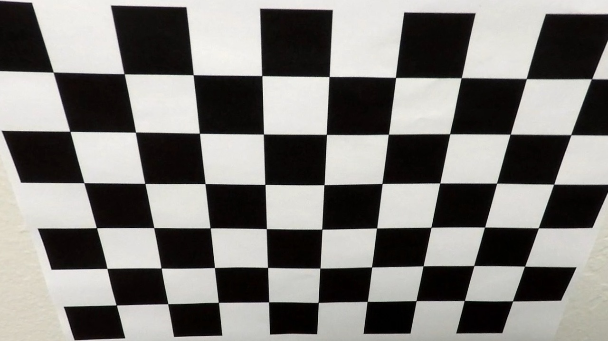
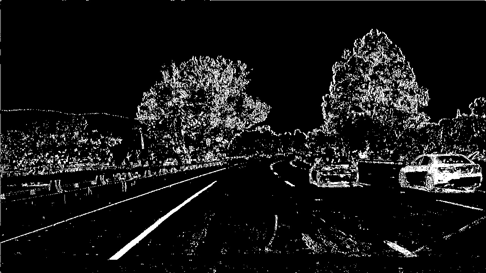
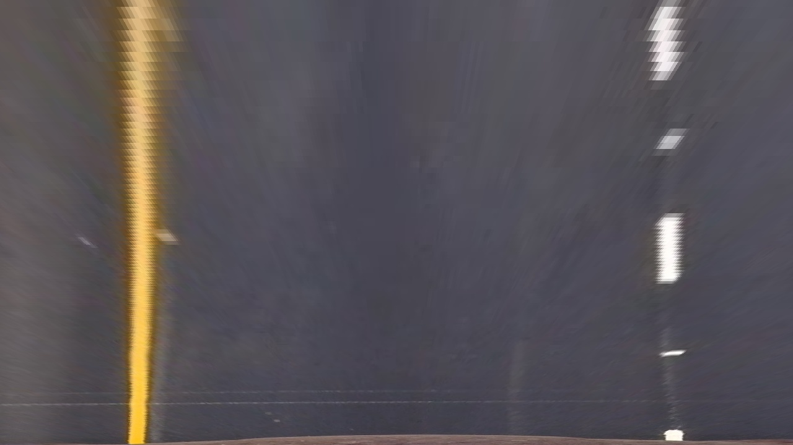
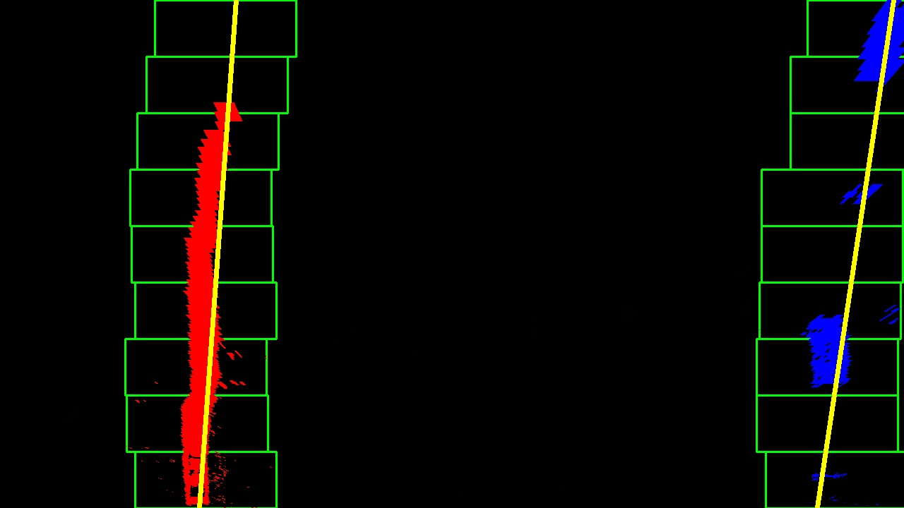
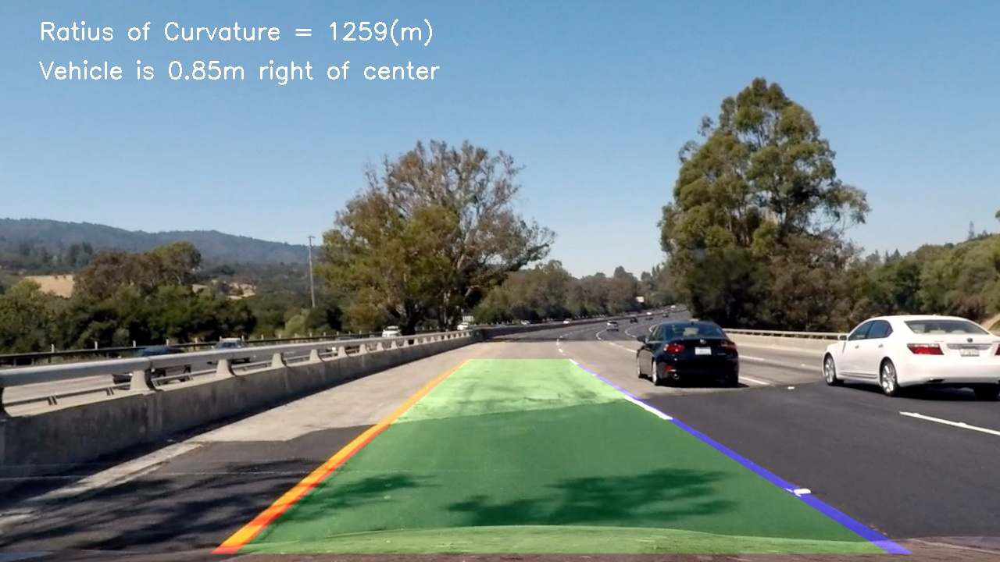

# Project 2 - Advanced Lane Finding

Here's some reflection of my work, and the codes are provided in ['Advanced Lane Finding.ipynb'](./Advanced Lane Finding.ipynb) and have been precisely divided by Rubrics. Running in turn could easily obtain the results shown in the [output_images](./output_images/) and [output_videos](./output_videos/).

---

**Advanced Lane Finding Project**

The goals / steps of this project are the following:

* Compute the camera calibration matrix and distortion coefficients given a set of chessboard images.
* Apply a distortion correction to raw images.
* Use color transforms, gradients, etc., to create a thresholded binary image.
* Apply a perspective transform to rectify binary image ("birds-eye view").
* Detect lane pixels and fit to find the lane boundary.
* Determine the curvature of the lane and vehicle position with respect to center.
* Warp the detected lane boundaries back onto the original image.
* Output visual display of the lane boundaries and numerical estimation of lane curvature and vehicle position.

[//]: # (Image References)

[img_overview]: ./img/overview.gif "Output Overview"


## [Rubric](https://review.udacity.com/#!/rubrics/571/view)

### Camera Calibration

First of all, to detect the calibration pattern in the [calibration images](./camera_cal/), we can use the function `cv2.findChessboardCorners(image, pattern_size)`. 

Once we stored the correspondeces between 3D world and 2D image points for the images, we can proceed to actually calibrate the camera through `cv2.calibrateCamera()`. This function returns the *camera matrix* and the *distortion coefficients*, which we can use to undistort the frames later.   

I applied this distortion correction to the image 'calibration2.jpg' using the `cv2.undistort()` function and obtained the following result: 




### Pipeline (single images)

#### 1. Provide an example of a distortion-corrected image.

Once the camera is calibrated, we can use the camera matrix and distortion coefficients we found to undistort also the test images. To demonstrate this step, I will describe how I apply the distortion correction to one of the test images like this one:


#### 2. Describe how (and identify where in your code) you used color transforms, gradients or other methods to create a thresholded binary image.  Provide an example of a binary image result.

I used a combination of color and gradient thresholds to generate a binary image (thresholding steps at lines # through # in `another_file.py`). Here's an example of my output for this step. All the other ways were included in the code though not needed.



#### 3. Describe how (and identify where in your code) you performed a perspective transform and provide an example of a transformed image.

The code for my perspective transform includes a function called `warper()`, which appears in lines 1 through 8 in the file `example.py` (output_images/examples/example.py) (or, for example, in the 3rd code cell of the IPython notebook).  The `warper()` function takes as inputs an image (`img`), as well as source (`src`) and destination (`dst`) points.  I chose the hardcode the source and destination points in the following manner:

```
    h, w = img.shape[:2]
    
    src = np.float32([[w, h-10],
                      [0, h-10],
                      [550, 460],
                      [730, 460]])
    dst = np.float32([[w, h],
                      [0, h],
                      [0, 0],
                      [w, 0]])

```

I verified that my perspective transform was working as expected by drawing the `src` and `dst` points onto a test image and its warped counterpart to verify that the lines appear parallel in the warped image.



#### 4. Describe how (and identify where in your code) you identified lane-line pixels and fit their positions with a polynomial?

Then I set two sliding windows for the left and right lane lines, and fit them with a 2nd order polynomial kinda like this:



#### 5. Describe how (and identify where in your code) you calculated the radius of curvature of the lane and the position of the vehicle with respect to center.

Since the camera is fixed and mounted in the midpoint of the car roof, thus we can approximate the car's deviation from the lane center as the distance between the center of the image and the midpoint at the bottom of the image of the two lane-lines detected.

During the previous lane-line detection phase, a 2nd order polynomial is fitted to each lane-line using `np.polyfit()`. This function returns the 3 coefficients that describe the curve, through them we can compute the radius of curvature of two lines before making an average to get the radius of curvature.

#### 6. Provide an example image of your result plotted back down onto the road such that the lane area is identified clearly.

I implemented all the front steps by build the pipeline function `process_image`.  Here is an example of my result on a test image:



---

### Pipeline (video)

#### 1. Provide a link to your final video output.  Your pipeline should perform reasonably well on the entire project video (wobbly lines are ok but no catastrophic failures that would cause the car to drive off the road!).

Here's a [link to my video result](./output_videos)

---

### Discussion

#### 1. Briefly discuss any problems / issues you faced in your implementation of this project.  Where will your pipeline likely fail?  What could you do to make it more robust?
Using my pipeline on the 'challenge_video.mp4' comes out a truely unstable [result](./output_videos/challenge_video.mp4). When the road color is not uniform enough and change at a certain edge, the identification should change different thresholds to adapt the case. So it may be a good choice training a CNN to automatically fit the best thresholds for a certain image.
